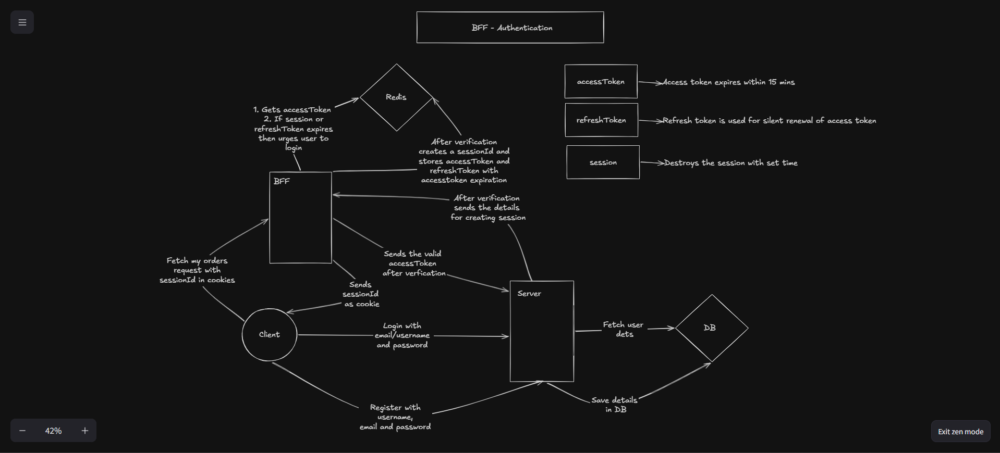

# BFF Auth - Backend For Frontend Authentication
- This authentication is used for making sure that very limited details are stored on the client
- Which supports with helping to defend against XSS and CSRG attacks.

## Flow of the authentication
